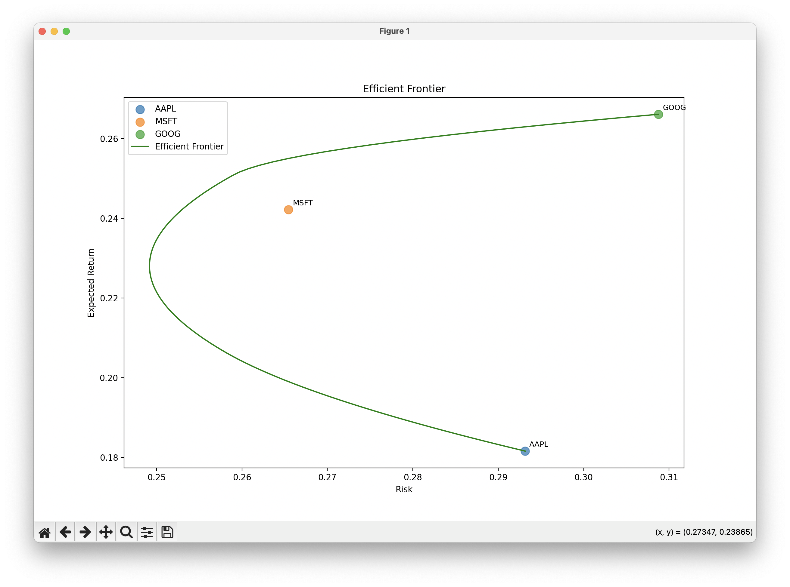

# 📈 Efficient Frontier Portfolio Optimisation Project

This project demonstrates portfolio optimisation using **Markowitz's Modern Portfolio Theory (MPT)**.  
It computes the efficient frontier for a set of assets, illustrating the trade-off between risk and return, and shows how individual stocks compare to optimal portfolios.

---

## 🚀 Project Overview

- Uses historical stock prices to estimate expected returns and covariances.  
- Constructs the efficient frontier using constrained optimisation (SLSQP) to find portfolios that minimise risk for a range of target returns.  
- Visualises both the efficient frontier and individual stock positions on a risk-return plot.  
- Applies Markowitz's mean-variance framework to explore optimal portfolio allocation.  

---

## 🛠 Technologies

- Python 3.8+
- Libraries: `numpy`, `matplotlib`, `scipy`, `yfinance`  

Install dependencies using `requirements.txt`:

```bash
pip install -r requirements.txt
```

## 🏁 Quick Start

Simply run the main script to see the efficient frontier in action:

```bash
python main.py
```
By default, the script uses the tickers:
```
['AAPL', 'MSFT', 'GOOG']
```
and fetches 5 years of historical adjusted closing prices.
The efficient frontier and individual stock points will be plotted automatically.


## 📊 Example Output

Here’s the efficient frontier for the default tickers `['AAPL', 'MSFT', 'GOOG']` over the past 5 years:

### Efficient Frontier with Individual Stocks



